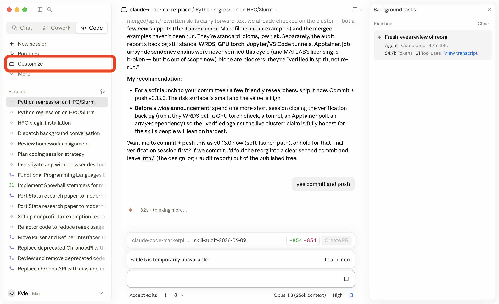
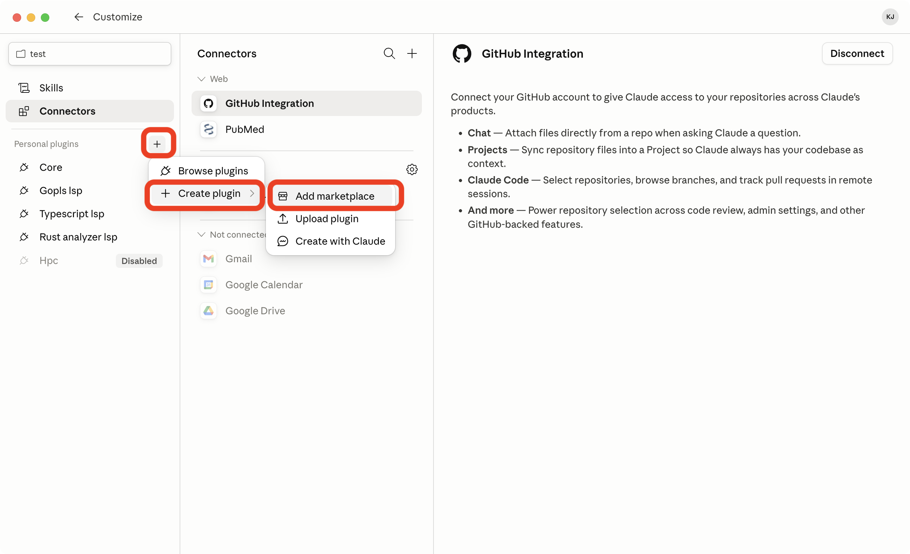
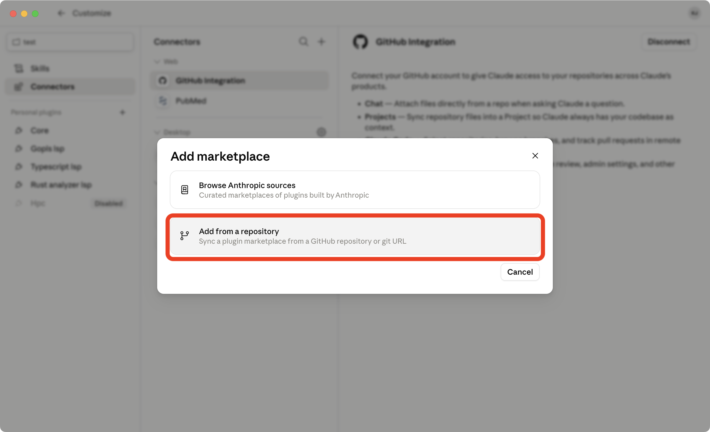
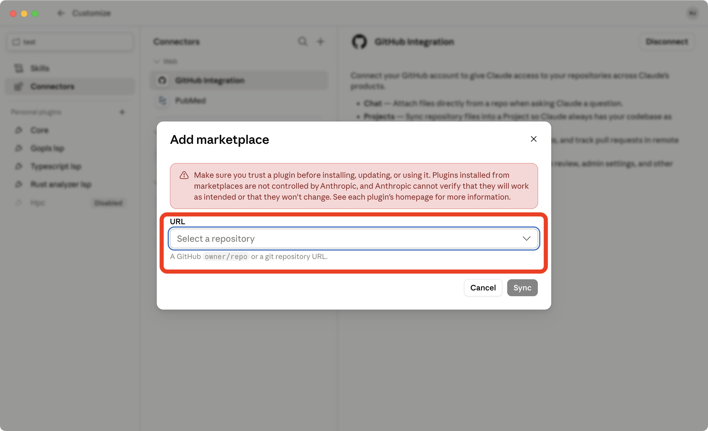

<div align="center">
  
  <h1>Yale SOM HPC<br>Claude Code Marketplace</h1>

</div>

This repo is a [Claude Code](https://code.claude.com/docs/en/overview) plugin marketplace of skills for Yale SOM research computing, centered on the Yale SOM HPC cluster (`hpc.som.yale.edu`) and covering general coding practices that help SOM scholars produce reproducible research. Install it into Claude Code to help write code, submit jobs, request GPUs, set up projects, query WRDS, review changes, and diagnose problems.

The skills were developed with two virtues in mind.

1. **Skillfulness.** Get your research done swiftly, beautifully, and correctly.
2. **Citizenship.** The HPC is a shared resource. Other people are running jobs right now on the same nodes, GPUs, and GPFS metadata servers.

_Authored on a best-effort basis by advanced HPC users and the Research Data Committee. This is practitioner guidance, not official SOM IT documentation — verify operational specifics (accounts, quotas, current policy) with HPC support, and the live cluster with `sinfo -s` / `module spider`._

## What's in the `hpc` plugin

Start with [overview](plugins/hpc/skills/overview/SKILL.md) — it's the front door, with the mental model, partition layout, and how the rest fit together. Then:

### Connect & set up

| Skill | Purpose |
|---|---|
| [connecting-securely](plugins/hpc/skills/connecting-securely/SKILL.md) | SSH keys, config, agents, Jupyter tunnels. |
| [staying-connected](plugins/hpc/skills/staying-connected/SKILL.md) | Durable sessions (tmux/zmx) and where Claude Code itself runs. |
| [starting-a-new-project](plugins/hpc/skills/starting-a-new-project/SKILL.md) | Reproducible project layout. |
| [installing-software](plugins/hpc/skills/installing-software/SKILL.md) | Modules, uv, static binaries, Apptainer. |
| [using-git-and-github](plugins/hpc/skills/using-git-and-github/SKILL.md) | Agent git behavior for researchers: commits, branches, big-file pushback. |
| [code-review](plugins/hpc/skills/code-review/SKILL.md) | Review for paths, data, seeds, lockfiles, cluster mistakes. |
| [programming-and-coding](plugins/hpc/skills/programming-and-coding/SKILL.md) | Cross-language research coding rules. |
| [task-runner](plugins/hpc/skills/task-runner/SKILL.md) | Capture project commands (shell/make/just) so steps are reproducible. |

### Run jobs

| Skill | Purpose |
|---|---|
| [managing-jobs](plugins/hpc/skills/managing-jobs/SKILL.md) | sbatch, arrays, dependencies, right-sizing loop. |
| [using-gpus](plugins/hpc/skills/using-gpus/SKILL.md) | When to request GPUs and how to verify they're used. |
| [using-the-filesystem](plugins/hpc/skills/using-the-filesystem/SKILL.md) | GPFS, project space, scratch, atomic writes. |
| [coding-in-python](plugins/hpc/skills/coding-in-python/SKILL.md) | General Python: uv, ruff, pathlib, scripts, logging, seeds. |
| [running-python](plugins/hpc/skills/running-python/SKILL.md) | uv, Slurm, thread control, resumable tasks. |
| [parallel-python](plugins/hpc/skills/parallel-python/SKILL.md) | Worker sizing, spawn-vs-fork, nested-parallelism warning. |
| [accelerating-python](plugins/hpc/skills/accelerating-python/SKILL.md) | Profiling, DuckDB/Polars/Numba, larger-than-memory data, when to add parallelism. |
| [coding-in-r](plugins/hpc/skills/coding-in-r/SKILL.md) | General R: renv, tidyverse/data.table, here, style, CLI scripts, seeds. |
| [running-r](plugins/hpc/skills/running-r/SKILL.md) | renv, Rscript Slurm jobs, BLAS thread control. |
| [running-stata](plugins/hpc/skills/running-stata/SKILL.md) | Batch do-files, scratch temp, license courtesy. |

### Work with data

| Skill | Purpose |
|---|---|
| [acquiring-data](plugins/hpc/skills/acquiring-data/SKILL.md) | WRDS, REST APIs, credentials, connection pooling, request-hash caches. |
| [scraping-at-scale](plugins/hpc/skills/scraping-at-scale/SKILL.md) | High-volume crawls: durable SQLite catalogs, single-archive bodies, /local staging. |

### Diagnose

| Skill | Purpose |
|---|---|
| [self-diagnosing-resource-use](plugins/hpc/skills/self-diagnosing-resource-use/SKILL.md) | sacct, seff, post-job right-sizing. |
| [troubleshooting](plugins/hpc/skills/troubleshooting/SKILL.md) | Triage common cluster errors (pending, killed, OOM, GLIBC, module) to fixes. |

## Commands

The plugin also ships a few slash commands as a typeable front door, so you don't have to phrase a request just right for the matching skill to load:

| Command | Does |
|---|---|
| `/hpc-checkup [JOBID]` | Checks whether your recent jobs were right-sized and tells you what to request next time. |
| `/hpc-new-project [name]` | Scaffolds a reproducible project (layout, lockfiles, `CLAUDE.md`, first test job). |
| `/hpc-connect` | Sets up a durable connection that survives laptop sleep / wifi drops. |

## Install

You need [Claude Code](https://code.claude.com/docs/en/overview) installed. This repo is a [plugin marketplace](https://code.claude.com/docs/en/discover-plugins) — a catalog Claude Code can browse — and `hpc` is the [plugin](https://code.claude.com/docs/en/plugins) inside it that bundles all the skills. To use the skills, you add the marketplace once, then install the plugin from it. Nothing runs on the cluster until you ask Claude to do something there.

Install it through whichever surface matches how you run Claude Code. Plugin state is shared per-user, so installing once enables `hpc` in every local Claude Code session on your machine.

**Prefer to watch?** Here's a short [video walkthrough of the GUI install](https://videos.kyle.pub/v/yale-som-hpc-claude-code-marketplace-install).

### Claude Code Desktop app

The Desktop app adds marketplaces through the **Customize** menu — *not* the **+** button next to the prompt box (that one only installs plugins from marketplaces you have already added).

1. In the left sidebar, click **Customize** → the **Plugins** tab.

   

2. Under **Personal plugins**, click **+** → **Add marketplace**.

   

3. Choose **Add from a repository**.

   

4. Paste the repository (a GitHub repo or git URL) and confirm:
   ```
   yale-som-hpc/claude-code-marketplace
   ```

   

5. Back in the **Plugins** tab, click **Browse plugins**, find `hpc`, and click **Install**. Make sure it is **enabled**.

See the [Desktop plugins docs](https://code.claude.com/docs/en/desktop#install-plugins) for the full UI walkthrough. Don't have the app yet? [Download Claude Desktop](https://claude.com/download).

### Claude Code in VS Code or Cursor

In the Claude Code prompt box, type:

```
/plugin
```

That opens the plugin manager. Go to the **Marketplaces** tab, click **Add marketplace**, and paste:

```
yale-som-hpc/claude-code-marketplace
```

Then switch to the **Discover** tab and install `hpc`. If you prefer typing, the CLI commands below work inside the chat box too.

### Claude Code CLI (terminal)

Inside Claude Code:

```
/plugin marketplace add yale-som-hpc/claude-code-marketplace
/plugin install hpc@yale-som-hpc
```

Update later with `/plugin marketplace update yale-som-hpc`. The full command list is in the [plugins reference](https://code.claude.com/docs/en/plugins-reference).

### Per-project (committed to a repo)

If you want every collaborator on a project to get the plugin automatically, commit the marketplace reference into the repo. Add a `.claude/settings.json` like:

```json
{
  "extraKnownMarketplaces": {
    "yale-som-hpc": {
      "source": {
        "source": "github",
        "repo": "yale-som-hpc/claude-code-marketplace"
      }
    }
  },
  "enabledPlugins": {
    "hpc@yale-som-hpc": true
  }
}
```

Anyone who opens the project in a local Claude Code session (Desktop, VS Code, Cursor, CLI) will be prompted to install the marketplace and plugin the first time they trust the folder. See [Configure team marketplaces](https://code.claude.com/docs/en/discover-plugins#configure-team-marketplaces) for the full reference.

## Verify

Inside Claude Code, run `/plugin`. You should see `hpc@yale-som-hpc` listed and enabled. Ask Claude something cluster-shaped ("write me an sbatch script for a Polars job on the SOM HPC cluster") and it should pull from the relevant skill.

## Repository layout

```
.claude-plugin/
└── marketplace.json          # marketplace manifest
plugins/hpc/
├── .claude-plugin/
│   └── plugin.json           # plugin manifest (bump version on release)
├── commands/<name>.md        # one file per slash command
└── skills/<name>/SKILL.md    # one directory per skill
```

A skill is a single `SKILL.md` with YAML frontmatter and a directive playbook body. Claude Code's skill loader reads the frontmatter to decide when to load each skill into context.

## Contributing

Most skills are short — a fix or new section is usually a one-PR change. If you're not ready to write a fix, file an issue.

### Filing an issue

Open an issue at <https://github.com/yale-som-hpc/claude-code-marketplace/issues>. Useful issues fall into a few buckets:

- **Skill is wrong.** A code example that fails on the current cluster, a partition name that no longer exists, a `module load` that errors. Include the command you ran and the error you got. Cluster-truth bugs are the highest-priority fixes.
- **Skill is missing.** A pattern you keep re-deriving (e.g. "how do I run a long-running Stan job", "how do I share a conda-installed binary with collaborators"). Describe the workflow and roughly what the rule should be — we'll figure out where it fits.
- **Skill is misfiring.** Claude is loading a skill on your laptop where it shouldn't, or not loading it on the cluster where it should. Include the prompt that triggered it and which skill fired.
- **Doc gap.** A README, install, or contribution-flow problem. Just describe what you tried and what was unclear.

You don't need to propose a fix. A clear "this happened, I expected this, instead I got this" is enough.

### Workflow

1. Fork or branch.
2. Edit the relevant `plugins/hpc/skills/<name>/SKILL.md`. For a new skill, copy an existing one as a template.
3. Bump the `version` in `plugins/hpc/.claude-plugin/plugin.json` (semver: bug fix → patch, content addition → minor, breaking reorganization → major).
4. Open a PR. Describe what changed and why. If you verified anything against the running cluster, say so.

### Skill acceptance criteria

Every skill should:

- Have YAML frontmatter: `name`, `description`, `related`, `updated`.
- Have a `description` with a `TRIGGER when ...` clause naming concrete signals (file extensions, tools, Slurm, GPFS, sbatch, git, etc.). Cluster-specific skills should gate on Yale SOM HPC context; general coding skills may fire on laptops too.
- Be directive and agent-usable: rules, not essay prose.
- Include copy-paste code examples with language-tagged fences.
- Cross-link related skills with relative paths.
- Use safe cluster defaults: no login-node compute, no credentials in scripts, no unsafe SSH key handling, `${SLURM_CPUS_PER_TASK:-1}` (never bare).
- End with a short checklist and a `## Further reading` section linking to canonical external docs.
- Date cluster-specific facts (`updated:` frontmatter) and tell users how to verify live state (`sinfo -s`, `module spider`, etc.).
- Avoid fixed compute-node hostnames except as explicit placeholders.

### What does not belong in these skills

- Domain packages unrelated to SOM research computing, or tools not useful to SOM scholars.
- Agent-operator internals that users should not need to know.
- Yale-specific operational policy that changes (which mailing list to email, who the current admin is, how to request an account). Link to the policy page instead.
- Long narrative explanations. Agents work best from short directive rules with a clear "why" sentence.

### Verifying changes against the cluster

If you change an sbatch template, a `module load` line, a partition name, or a path, run it on the cluster before merging. The skills exist so that an agent following them produces something that actually works; drift between the skills and live cluster state is the main failure mode.

## License

Released into the public domain under [The Unlicense](LICENSE).
